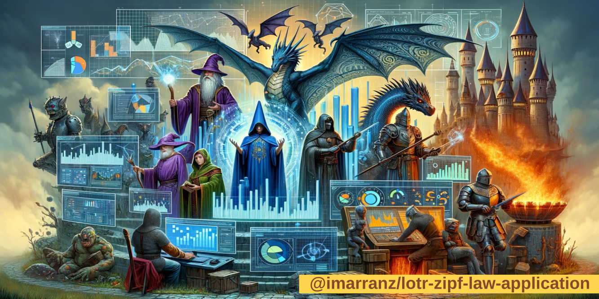

<p align="center">
   
</p>

# Análisis de los textos de "El Señor de los Anillos" y la Ley de Zipf

Este repositorio contiene un proyecto de análisis de datos en el que se exploran los tres libros de "El Señor de los Anillos" de J.R.R. Tolkien en relación con la Ley de Zipf.

 Mi fascinación por la Ley de Zipf comenzó cuando me topé con ella por primera vez en el libro "Caos, Orden y otras movidas del universo". Esta ley, con su intrigante afirmación de que las palabras en cualquier idioma se distribuyen de manera tan predecible, captó mi atención inmediatamente. Su simplicidad y profundidad me parecieron tan sorprendentes que me sentí impulsado a explorarla más a fondo. ¿Podría esta ley aplicarse uniformemente a través de diferentes textos y contextos lingüísticos? Con esta pregunta en mente, decidí realizar este proyecto personal: aplicar mi propio análisis de la Ley de Zipf a los libros de "El Señor de los Anillos". Estas obras, ricas en lenguaje y estilo, ofrecían el escenario perfecto para investigar esta ley.


## Introducción

La Ley de Zipf es una ley estadística que se aplica a los datos lingüísticos, especialmente en el análisis de la frecuencia de las palabras en un idioma. Matemáticamente, se puede representar con la ecuación:

\[ f(n) = \frac{C}{n^a} \]

Donde:

  * \( f(n) \) es la frecuencia de la palabra en el puesto \( n \),
  * \( C \) es una constante proporcional a la cantidad total de palabras,
  * \( a \) es aproximadamente 1.

Esta ley sugiere que la palabra más común en un idioma aparece aproximadamente dos veces más que la segunda más común, tres veces más que la tercera, y así sucesivamente. Este proyecto busca explorar cómo los textos de "El Señor de los Anillos" se ajustan a esta ley.

## Estructura del Repositorio

  * `/notebooks`: Notebooks de Python para procesamiento y análisis.
  * `/data`: Datos procesados y conjuntos de datos auxiliares.
  * `/figures`: Figuras utilizadas en el repositorio.
  * `README.md`: Descripción general y guía del proyecto.
  * `LICENSE.md`: Licencia del repositorio.

## Datos

Los datos se han obtenido en la siguiente dirección de [kaggle](https://www.kaggle.com/datasets/ashishsinhaiitr/lord-of-the-rings-text). Los textos se han guardado en tres ficheros de texto:

  * **The Fellowship Of The Ring.txt** (997,9 KiB)
  * **The Two Towers.txt** (816,3 KiB)
  * **The Return Of The King.txt** (707,7 KiB)

Que puedes encontrar en la carpeta `/data`.

## Proceso de Análisis

  * **Preparación de Datos**: Extracción y limpieza de textos.
  * **Cálculo de Frecuencias**: Frecuencia de cada palabra.
  * **Análisis de la Ley de Zipf**: Correlación con la ley.

## Visualización y Resultados

Gráficos y tablas en `/notebooks` muestran la conformidad de los textos con la Ley de Zipf. Si necesitas exportar el fichero `/notebooks/lotr-zipf-law-application.ipynb` a otros formatos puedes utilizar los siguientes comandos:

### Exportar a Markdown

```
$ jupyter nbconvert --to markdown lotr-zipf-law-application.ipynb
```

### Exportar a HTML

```
$ jupyter nbconvert --to html lotr-zipf-law-application.ipynb
```

## Cómo Contribuir

Estamos abiertos a contribuciones. Si deseas colaborar, considera lo siguiente:

  * **Reporte de Errores**: Informa de cualquier error o problema encontrado.
  * **Mejoras en el Código**: Propuestas para mejorar el código existente.
  * **Nuevas Funciones**: Ideas para nuevas características o análisis.
  * **Documentación**: Mejoras en la documentación o traducciones.

Por favor, sigue las normas de codificación y documentación establecidas en el repositorio.


